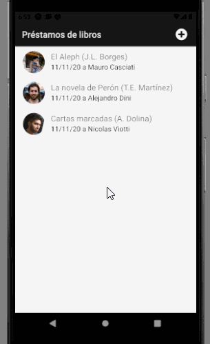
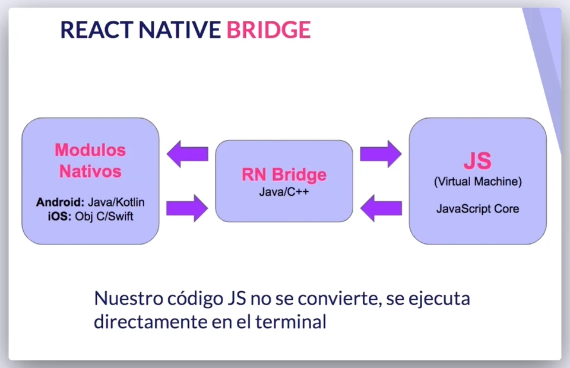
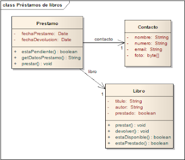

# Préstamos de libros
Desarrollar una aplicación que permita hacer un seguimiento de los libros que prestamos a nuestros contactos.



## React Native
Es un framework de programación de aplicaciones nativas multiplataforma que está basado en React.

[Documentación oficial de React Native.](https://reactnative.dev/docs/getting-started)

Aclaraciones:
- No permite ejecutar aplicaciones que tenemos ya desarrolladas con React.
- No es una página web generada en un webview, sino que genera una aplicación nativa con un rendimiento casi similar al nativo.
- No convertirá el código en una aplicación nativa, transpilado a Java o ObjectiveC.
- No evita tener que tocar código de Android o de iOS, aunque permite integrar todas las partes que se tengan de ambos sistemas en una sola aplicación, con algunas diferencias pero con una parte del código compartido y escrito en JavaScript, utilizando JSX para definir las interfaces.


React Native genera un doble thread, en el cual tenemos uno corriendo todo el código nativo, toda la parte que sigue ejecutando módulos nativos como la interfaz o cualquier librería que tengamos integrada ya existente con programación en Android en iOS, y por otro tenemos corriendo una máquina virtual ejecutando JavaScript.

El bridge de React Native es el que va a permitir la comunicación entre ambos threads. 



## Expo

Expo es un framework con un conjunto de herramientas, librerías y servicios los cuales te permiten desarrollar apps nativas en iOS y Android escritas en JavaScript. Expo utiliza Expo SDK, el cual es una librería nativa y de JavaScript que provee acceso a la funcionalidad del dispositivo como a la cámara, contactos, almacenamiento local, entre otros) **sin modificar código nativo**, ya que puede correr y visualizarse en cualquier dispositivo que tenga instalado la app de Expo, aún sin tener instalado Android Studio o Xcode.

[Documentación oficial de expo.](https://docs.expo.io/)

## Instalación de entorno recomendada

### NodeJS
https://nodejs.org/en/

---
### Yarn
https://yarnpkg.com/en/docs/install#windows-stable

---
### Visual Studio Code 
https://code.visualstudio.com/

### Plugins para Visual Studio Code

[ESLint](https://marketplace.visualstudio.com/items?itemName=dbaeumer.vscode-eslint)

[ES7 React/Redux/GraphQL/React-Native snippets](https://marketplace.visualstudio.com/items?itemName=dsznajder.es7-react-js-snippets)
> A tener en cuenta: rncs, rnfs, met, cp, cs, rconst, cdm, cdup, cwun, clo

[Expo Tools](https://marketplace.visualstudio.com/items?itemName=expo.vscode-expo-tools)

---
### Expo Client  
```console
npm install -g expo-cli
```
opcionalmente
```console
yarn add global expo-cli
```
> Hay que agregar la carpeta de donde npm o yarn instala los paquetes globales al PATH en caso de que no este, en el caso de windows por defecto es C:\Users\\**USERNAME**\AppData\Roaming\npm  

---
### Emulador (opcional)
Recomiendo bajarse el Android studio para usar el AVD manager.  
https://developer.android.com/studio


Abrir menu de opciones en emulator:  
`ctrl + m`

---
### Expo App para telefono
Bajarlo en el teléfono y el emulador
https://play.google.com/store/apps/details?id=host.exp.exponent
https://apps.apple.com/es/app/expo-client/id982107779

---
### React devtools (opcional)
```console
npm i -g react-devtools@^3
```


## Primeros pasos

### Nueva aplicación
```console
expo init eg-prestamos-react-native-expo
cd eg-prestamos-react-native-expo
```
> Este comando puede necesitar permisos de administrador o una consola interactiva

Esto genera varios archivos de los cuales tenemos que tener en cuenta

**package.json**  
Igual que react y angular podemos declarar dependencias de npm o yarn.

**app.json**  
Cualquier configuración con respecto a expo o la app en general.

Empezamos poniendo
```json
    "name": "nombre de la app",
    "slug": "id de la app para expo",
```
> Cambiar el valor de *slug* hará que expo la considere como otra app

Otras configuraciones de *app.json* en https://docs.expo.io/versions/latest/config/app/

### Corriendo la aplicación

Para correrlo usamos  
```console
expo start
```

### Explicación

El objetivo de esta aplicación es:

* acceder a la lista de contactos del dispositivo, tanto para recuperarlos como para agregar
* tiene una vista principal list para mostrar los préstamos,
* y un menú que se activa con un click largo sobre un elemento, que permite
  * devolver el libro
  * o contactar a quien nos debe el libro por mail o llamándolo
* también podemos crear un préstamo, para lo cual hay un formulario con validaciones
* y por último, la aplicación se puede configurar para hacerse persistente en la base interna del dispositivo (SQLite)

### El modelo

Nuestro dominio es bastante sencillo:



#### Decisiones a tomar

* los contactos ¿salen del dispositivo o tendremos una entidad aparte? Lo más razonable es que el objeto Contacto esté asociado a los que cargamos en nuestro dispositivo, pero esta es una decisión que hay que consensuar con el usuario.
* ¿dónde guardamos los préstamos? ¿necesitaremos identificadores unívocos?
* ¿cómo navegar la aplicación?

---

## Explicaciones adicionales

* [Pantallas, stacks y rutas](docs/rutasYPantallas.md)
* [Pantalla principal: lista de préstamos](docs/listaPrestamos.md)
* [Contactar un deudor](docs/contactarDeudor.md)
* [Nuevo préstamo](docs/nuevoPrestamo.md)
* [Interacción con API de Contactos](docs/apiContactos.md)
* [Persistencia a un medio local con SQLite](docs/persistenciaLocal.md)


