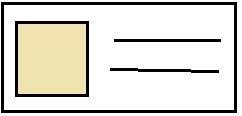

# Lista de préstamos

La primera versión de nuestra pantalla es simple

* FlatList de préstamos

```tsx
render(): ReactNode {
    const { prestamos } = this.state
    return (
        <FlatList
            style={ styles.lista }
            data={ prestamos }
            renderItem={ this.renderPrestamo }
            keyExtractor={ item => String(item.id) }
        />
    )
}

```

https://reactnative.dev/docs/flatlist

### Layout

A diferencia de React los estilos no pueden estar en un archivo de estilos css, los componentes aceptan la propiedad `style` donde se pueden escribir los estilos en linea pero es recomendado definir múltiples estilos utilizando el método `StyleSheet.create`:

```tsx
const styles = StyleSheet.create({
    lista: {
        flex: 1,
        backgroundColor: 'rgb(242, 242, 242)'
    },
    prestamo: {
        paddingVertical: 10,
        paddingHorizontal: 18,
        backgroundColor: 'white',
        flexDirection: 'row'
    },
    imgContacto: {
        height: 50,
        width: 50,
        borderRadius: 50,
        marginRight: 14
    },
    libro: {
        fontSize: 18,
        color: 'grey'
    },
    datos: {
        fontSize: 16
    }
})
```

## La lista de préstamos

El juego de datos se inicializa a partir de una lista de préstamos, que creamos en PrestamosService y que pueden ver en caso de interés.

Para cargar la lista de préstamos se lo pediremos al repositorio.
```tsx
cargarPrestamos = async (): Promise<void> => {
    const prestamos = await repoPrestamos.getPrestamosPendientes()
    this.setState({ prestamos })
}
```

Por cada préstamo visualicemos:

* la imagen del contacto al que le prestamos el libro
* el título del libro
* la fecha y el nombre del contacto

### Layout de un préstamo como fila

Creamos un método el le pasamos al componente `FlatList` que define la vista de cada fila:

```tsx
renderPrestamo = ({ item }: { item: Prestamo }): ReactElement => {
    return (
        <View style={ styles.prestamo }>
            <Image
                style={ styles.imgContacto }
                source={ item.contacto.foto || require('../../assets/defaultContact.png')}
                resizeMode='contain'
                resizeMethod='resize'
            />
            <View style={styles.contenedorTexto}>
                <Text style={ styles.libro }>{ item.libro.toString() }</Text>
                <Text style={ styles.datos }>{ item.datosPrestamo() }</Text>
            </View>
        </View>
    )
}
```

Para eso definimos un primer layout que será horizontal, donde ubicaremos la foto del contacto. Luego otro layout vertical permitirá que pongamos la descripción del libro y los datos del préstamo con un tamaño más chico.



---

Aunque aquí usamos FlatList para mostrar la lista también podríamos usar ScrollView y manejar nosotros mismos la visualización. [Pueden estudiar una comparación de ambas formas de visualizar listas aquí.](https://reactnative.dev/docs/scrollview)
