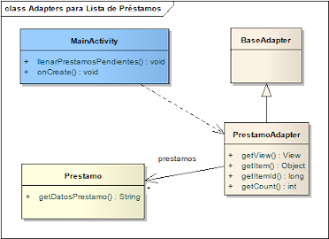

# Lista de préstamos

La primera versión de nuestra pantalla es simple

* FlatList de préstamos

```tsx
render(): JSX.Element {
    const { prestamos } = this.state
    return (
        <FlatList
            style={ styles.lista }
            data={ prestamos }
            renderItem={ this.renderPrestamo }
            keyExtractor={ item => String(item.id) }
        />
    )
}

```

https://reactnative.dev/docs/flatlist

### Layout

Al definir el layout en el ancho (width) y alto (height):

* para el ancho del textview que muestra la información de un libro consideraremos el tamaño de la pantalla: match_parent
* para el alto, nos interesa que aparezca toda la información del libro sin truncar, por eso usamos wrap_content

## Controller

El juego de datos se inicializa a partir de una lista de préstamos, que creamos en el singleton PrestamosAppBootstrap y que pueden ver en caso de interés.

## Adapter entre ListView y la lista de préstamos

```tsx
cargarPrestamos = (): void => {
    const prestamos = repoPrestamos.getPrestamosPendientes()
    this.setState({ prestamos })
}
```

Esto permite asociar la lista de elementos de la ListView con un conjunto de datos:

El PrestamoAdapter permite que por cada préstamo visualicemos:

* la imagen del contacto al que le prestamos el libro
* el título del libro
* la fecha y el nombre del contacto

### Layout de un préstamo como fila

Creamos un nuevo xml (parados sobre res/layout hacemos new Android XML File) que define la vista de cada fila. La llamamos prestamo_row.xml:

```tsx
renderPrestamo = ({ item }: { item: Prestamo }): JSX.Element => {
    return (
        <View style={ styles.prestamo }>
            <Image
                style={ styles.imgContacto }
                source={ item.contacto.foto || require('../../assets/defaultContact.png')}
                resizeMode='contain'
                resizeMethod='resize'
            />
            <View>
                <Text style={ styles.libro }>{ item.libro.toString() }</Text>
                <Text style={ styles.datos }>{ item.datosPrestamo() }</Text>
            </View>
        </View>
    )
}
```

Para eso definimos un primer layout que será horizontal, donde ubicaremos la foto del contacto. Luego otro layout vertical permitirá que pongamos la descripción del libro y los datos del préstamo con un tamaño más chico (textAppearanceSmall).


### Controller de la fila de un préstamo

La clase PrestamoAdapter por un lado conoce a la lista de préstamos pendientes (una lista **mutable**), pero también ajusta el contenido de un préstamo al xml que acabamos de definir:

```tsx

```

Mientras que en otros ejemplos utilizamos un Recycler View, aquí desacoplamos el objeto que adapta la vista de una fila de la actividad principal (`MainActivity.kt`). [Pueden estudiar una comparación de ambas formas de visualizar colecciones en Android aquí.](https://stackoverflow.com/questions/26728651/recyclerview-vs-listview).


