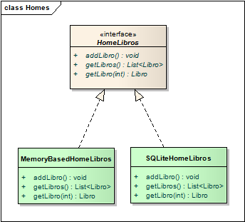

# Persistencia a un medio local

Entre los recursos disponibles de los dispositivos contamos con una API que permite persistir la información localmente, gracias a un motor que soporta el modelo relacional llamado [SQLite](https://www.sqlite.org/index.html).

Algunas características de este motor son:

* es liviano, sólo necesita 250K de memoria para ejecutarse
* no sólo funciona sino que además viene embebido en la VM de Android (ART)
* es open-source
* su distribución es gratuita
* como dijimos antes es un motor relacional, que 
* soporta transaccionalidad
* permite definir PRIMARY KEYs
* también claves subrogadas (ID auto incrementale)
* tiene un acotado sistema de tipos, apenas TEXT (String), INTEGER (int o Long), y REAL (double)

Para más detalles recomendamos la lectura de [esta página](http://www.vogella.com/tutorials/AndroidSQLite/article.html).

## Instalacion

Tendremos que instalar la dependencia `expo-sqlite`.

```console
expo install expo-sqlite
```

## Definición de estructuras de las tablas

La aplicación corre en el dispositivo, justamente donde necesitamos generar las tablas en el caso en que no existan. Entonces nuestro primer trabajo es definir un objeto que genere la estructura de las tablas Libros y Préstamos (los contactos ya se persisten):

```tsx
const DATABASE_NAME = "librex.db"

const db = SQLite.openDatabase(DATABASE_NAME)

class SQLiteHelper {
    /**
     * Script para iniciar la base
     */
    onCreate(): Promise<void> {
        return new Promise((resolve, reject) =>
            db.transaction(tx => {
                tx.executeSql(
                    `CREATE TABLE IF NOT EXISTS Libros (
                        id INTEGER PRIMARY KEY AUTOINCREMENT,
                        titulo TEXT NOT NULL,
                        autor TEXT NOT NULL,
                        prestado BOOLEAN NOT NULL
                    );`
                )
                tx.executeSql(
                    `CREATE TABLE IF NOT EXISTS Prestamos (
                        id INTEGER PRIMARY KEY AUTOINCREMENT,
                        fechaPrestamo DATETIME NOT NULL,
                        fechaDevolucion DATETIME,
                        libro_id INTEGER NOT NULL,
                        contacto_id TEXT NOT NULL
                    );`
                )
            }, reject, resolve)
        )
    }
}
export default new SQLiteHelper()
```

Los métodos que definimos son:

* **onCreate:** el evento que se dispara la primera vez que se crea la base de datos
* **onUpgrade:** cuando se sube la versión de la base de datos, la estrategia (discutible) es eliminar las tablas libros y préstamos y volverlos a recrear. Tendríamos que analizar otras variantes si la información es sensible. Teniendo en cuenta que la app tiene fines didácticos no nos detenemos en este punto.

## Un nuevo hogar para los libros

Hasta el momento teníamos:

* una interfaz RepoLibros
* y una implementación concreta CollectionBasedLibros

lo cual parecía una solución un tanto sobre diseñada. No obstante aquí vamos a generar una nueva clase, que va a terminar enviando mensajes a la base de datos local



## Implementación del repositorio de libros

* la alternativa más sencilla es definir una clase que implemente el repositorio de libros
* otra opción es implementar un Provider que termine generando los queries de insert, update, delete y select a la base, pero eso agrega un grado más de indirección, con su correspondiente complejidad

### Alta de un libro

Veamos cómo se codifica el alta de un libro:

```tsx
 addLibro(libro: Libro): void {
    db.transaction(tx => {
        tx.executeSql(
            'INSERT INTO Libros (titulo, autor, prestado) values (?, ?, ?);',
            [libro.titulo, libro.autor, libro.prestado]
        )
    })
    console.log(`Se creó libro ${libro}`)
}
```

 Tenemos que mapear cada atributo del libro con su correspondiente campo en la tabla Libros. Como los atributos son pocos y además utilizan tipos primitivos, no parece haber mucho trabajo, pero nos imaginamos que al persistir el préstamo (que tiene una relación con un objeto Libro) la cosa no va a ser tan sencilla.

### Manejando el asincronismo

Para poder simplificar el manejo de callbacks que nos provee la librería, voy a crear un método en `SQLiteHelper` para convertir la llamada en una promesa y así poder manejarme con `async` y `await`.

```tsx
executeSql(sqlStatement: string, args?: any[]): Promise<SQLite.SQLResultSet> {
    return new Promise((resolve, reject) =>
        db.transaction(tx => {
            tx.executeSql(
                sqlStatement,
                args,
                (_, result) => resolve(result),
                (_, error) => {
                    reject(error)
                    return false
                }
            )
        }, reject)
    )
}
```

### Búsqueda de un libro

Ahora resolveremos la búsqueda de libros en la base:

```tsx
async getLibros(): Promise<Libro[]> {
    const { rows } = await SQLiteHelper.executeSql(
        'SELECT * FROM Libros;'
    )
    const result = Array.from({length: rows.length}, (_, i) => rows.item(i)).map(this.libroFromRow)
    console.log("getLibros", result)
    return result
}
```

```tsx
 async getLibro(libroOrigen: Partial<Libro>): Promise<Libro | undefined> {
    const { rows } = await SQLiteHelper.executeSql(
        'SELECT * FROM Libros WHERE id = ? OR titulo = ? LIMIT 1;',
        [ libroOrigen.id, libroOrigen.titulo || '' ]
    )
    let result
    if (rows.length) result = this.libroFromRow(rows.item(0))
    console.log('getLibro', result)
    return result
}
```

La query hace una búsqueda _by example_ pasando valores para los campos.

### Modificaciones en la configuración

Modificamos la configuración de los repositorios para la aplicación

```tsx
export const repoLibros: RepoLibros = new SQLiteBasedLibros()
```

La clase PrestamosService no cambia nada, porque la variable repoLibros toma el tipo RepoLibros genérico:

```tsx
elAleph = await repoLibros.addLibroSiNoExiste(elAleph)
laNovelaDePeron = await repoLibros.addLibroSiNoExiste(laNovelaDePeron)
cartasMarcadas = await repoLibros.addLibroSiNoExiste(cartasMarcadas)
```

## Repositorios polimórficos

Para que el lector compruebe que los repositorios son efectivamente polimórficos, se puede volver atrás la configuración del home de libros:

```tsx
export const repoLibros: RepoLibros = new CollectionBasedLibros()
```

Y vemos que el comportamiento para actualizar los libros se mantienen, funcionando los homes en forma polimórfica para las actividades y fragments. Dejamos para que el lector investigue en el ejemplo cómo se resuelve la persistencia de los préstamos.
